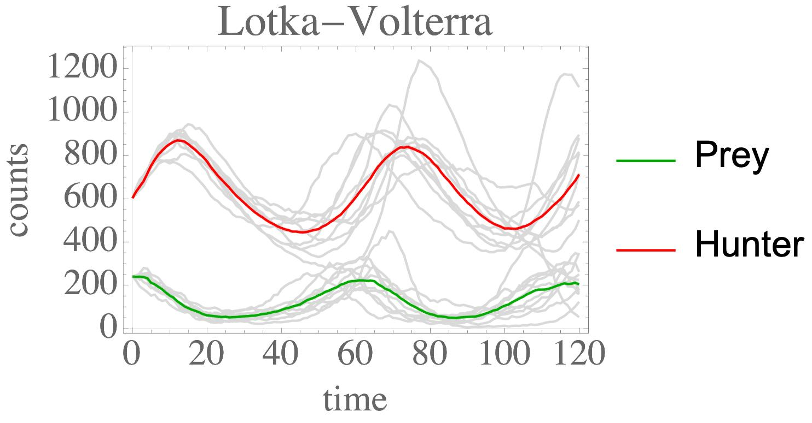

# A simple Gillespie library for C++

**Useful** libraries are simple to understand for use in your own project.

This library is as simple as it gets and should serve as a simple stepping stone for other Gillespie codes in C++.

Hopefully, because it's entirely C++, it will beat out some other Python variants out there.




## Features

* Simple STL + `C++ 17` standard.
* Gillespie algorithm.
* Tau leaping, with adaptive tau step as in [Cao 2006](https://doi.org/10.1063/1.2159468).

## Installing

* Clone the repo.
* `mkdir build && cd build`
* `cmake ..`
* `make && make install`

The default install location is `/usr/local/lib`.

It requires `std==c++17` to work with the filesystem for i/o.
The namespace is `gilsp`.

## Example

Here is a simple snippet for the reacton `A -> 0` (note: bimolecular and higher order reactions **are also supported**). It is in the [example](example) directory.
```
#include <iostream>
#include <vector>

#include <gilsp>

using namespace gilsp;
using namespace std;

int main() {

    // Random seed
    srand (time(NULL));

    // Make the reaction A->0 with rate 3
    Rxn rxn = Rxn("rxn", 3.0, {"A"}, {});

    // Initial counts of particles
    Counts counts = Counts();
    counts.set_count("A", 100);

    // Run
    Gillespie g;
    vector<Rxn> rxn_list({rxn});
    double dt_st_every = 0.1;
    double t_max = 100.0;
    CountsHist counts_hist = g.run(rxn_list, counts, dt_st_every, t_max);

    // Print it
    counts_hist.print();

    // Write it
    counts_hist.write_all_count_hist("../data");

    return 0;
}
```

